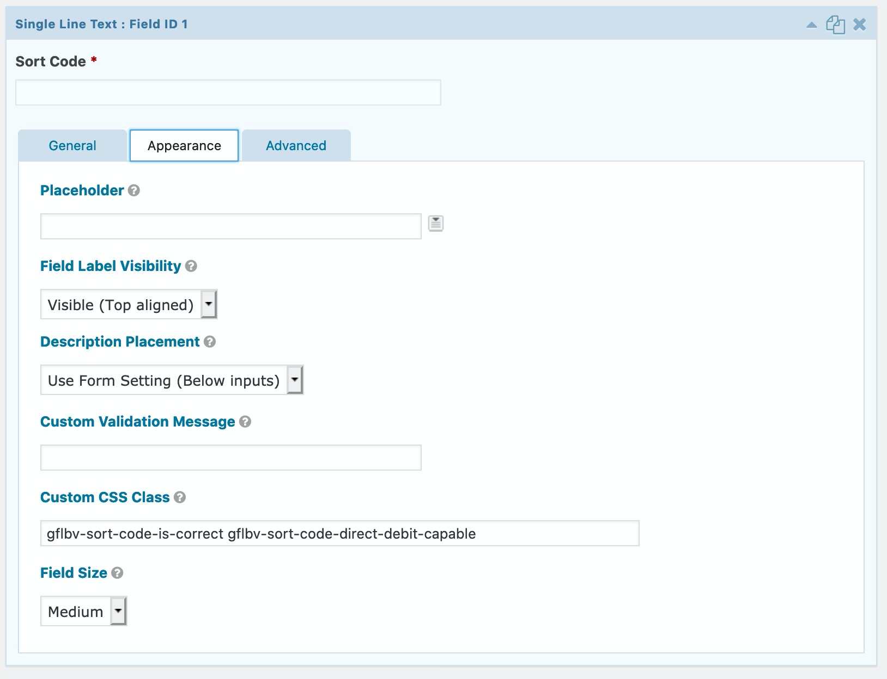

# GF Loqate Bank Verification

[](https://circleci.com/gh/ItinerisLtd/gf-loqate-bank-verification)
[](https://packagist.org/packages/itinerisltd/gf-loqate-bank-verification)
[](https://wordpress.org/plugins/gf-loqate-bank-verification)
[](https://packagist.org/packages/itinerisltd/gf-loqate-bank-verification)
[](https://wordpress.org/plugins/gf-loqate-bank-verification)
[](https://packagist.org/packages/itinerisltd/gf-loqate-bank-verification/stats)
[](https://wordpress.org/plugins/gf-loqate-bank-verification/advanced/)
[](https://github.com/ItinerisLtd/gf-loqate-bank-verification/blob/master/LICENSE)
[](https://www.itineris.co.uk/contact/)
[](https://twitter.com/itineris_ltd)
[](https://twitter.com/tangrufus)

Verify Gravity Forms bank details with Loqate bank verification API.

<!-- START doctoc generated TOC please keep comment here to allow auto update -->
<!-- DON'T EDIT THIS SECTION, INSTEAD RE-RUN doctoc TO UPDATE -->


- [Goal](#goal)
- [Usage](#usage)
  - [Get your service key from Loqate](#get-your-service-key-from-loqate)
  - [Plugin Setting](#plugin-setting)
  - [Form Fields Setting](#form-fields-setting)
- [Minimum Requirements](#minimum-requirements)
- [Installation](#installation)
  - [Composer (Recommended)](#composer-recommended)
  - [wordpress.org (WP CLI)](#wordpressorg-wp-cli)
  - [wordpress.org](#wordpressorg)
  - [Build from Source (Not Recommended)](#build-from-source-not-recommended)
- [FAQ](#faq)
  - [Does it support checking for Direct Debit capability?](#does-it-support-checking-for-direct-debit-capability)
  - [Does it cache Loqate API responses?](#does-it-cache-loqate-api-responses)
  - [Will you add support for older PHP versions?](#will-you-add-support-for-older-php-versions)
  - [It looks awesome. Where can I find more goodies like this?](#it-looks-awesome-where-can-i-find-more-goodies-like-this)
  - [Where can I give :star::star::star::star::star: reviews?](#where-can-i-give-starstarstarstarstar-reviews)
- [Testing](#testing)
- [Feedback](#feedback)
- [Change Log](#change-log)
- [Security](#security)
- [Credits](#credits)
- [License](#license)

<!-- END doctoc generated TOC please keep comment here to allow auto update -->

## Goal

[GF Loqate Bank Verification](https://github.com/ItinerisLtd/gf-loqate-bank-verification) verifies [Gravity Forms](https://www.gravityforms.com/) bank details with [Loqate bank verification API](https://www.loqate.com/resources/support/apis/BankAccountValidation/Interactive/Validate/2/).

It validates the bank details (branch sort codes and bank account numbers):
- indicates whether the account number and sortcode are valid
- indicates whether the account can accept direct debits. Certain accounts (e.g. savings) will not accept direct debits

## Usage

### Get your service key from Loqate

1. Register an [Loqate](https://www.loqate.com) account
2. Add **Bank Verification**
3. Get the **Service key**


### Plugin Setting

1. Head to **Form** » **Settings** » **Bank Verification**
2. Enter your Loqate bank verification **service key**

A green check :white_check_mark: appears if the service key is valid.


### Form Fields Setting

1. Add 2 **Single Line Text** fields
  - Sort Code
  - Account Number
2. Mark both fields **required**
3. Set their **Custom CSS Class** to:
  - `gflbv-sort-code-is-correct`
  - `gflbv-account-number-is-correct`




## Minimum Requirements

- PHP v7.2
- WordPress v4.9.10
- [Gravity Forms](https://www.Gravity Forms.com/) v2.4.14.4

## Installation

### Composer (Recommended)

```bash
composer require itinerisltd/gf-loqate-bank-verification
```

### wordpress.org (WP CLI)

```bash
wp plugin install gf-loqate-bank-verification
```

### wordpress.org

Download from https://wordpress.org/plugins/gf-loqate-bank-verification 
Then, install `gf-loqate-bank-verification.zip` [as usual](https://codex.wordpress.org/Managing_Plugins#Installing_Plugins).

### Build from Source (Not Recommended)

```bash
# Make sure you use the same PHP version as remote servers.
# Building inside docker images is recommanded.
php -v

# Checkout source code
git clone https://github.com/ItinerisLtd/gf-loqate-bank-verification.git
cd gf-loqate-bank-verification
git checkout <the-tag-or-the-branch-or-the-commit>

# Build the zip file
composer release:build
```

Then, install `release/gf-loqate-bank-verification.zip` [as usual](https://codex.wordpress.org/Managing_Plugins#Installing_Plugins).

## FAQ

### Does it support checking for Direct Debit capability?

Yes. Certain accounts (e.g. savings) will not accept direct debits. To verify bank details are both correct and Direct Debit capable, set the fields' **Custom CSS Class** to:
- `gflbv-sort-code-is-correct gflbv-sort-code-direct-debit-capable`
- `gflbv-account-number-is-correct gflbv-account-number-direct-debit-capable`

### Does it cache Loqate API responses?

Yes. Loqate API responses are cached in [WordPress transients](https://codex.wordpress.org/Transients_API) for an hour.

To clear caches:

```bash
wp transient delete --all
```

### Will you add support for older PHP versions?

Never! This plugin will only work on [actively supported PHP versions](https://secure.php.net/supported-versions.php).

Don't use it on **end of life** or **security fixes only** PHP versions.

### It looks awesome. Where can I find more goodies like this?

- Articles on [Itineris' blog](https://www.itineris.co.uk/blog/)
- More projects on [Itineris' GitHub profile](https://github.com/itinerisltd)
- More plugins on [Itineris](https://profiles.wordpress.org/itinerisltd/#content-plugins) and [TangRufus](https://profiles.wordpress.org/tangrufus/#content-plugins) wp.org profiles
- Follow [@itineris_ltd](https://twitter.com/itineris_ltd) and [@TangRufus](https://twitter.com/tangrufus) on Twitter
- Hire [Itineris](https://www.itineris.co.uk/services/) to build your next awesome site

### Where can I give :star::star::star::star::star: reviews?

Thanks! Glad you like it. It's important to let my boss knows somebody is using this project. Please consider:

- leave a 5-star review on [wordpress.org](https://wordpress.org/support/plugin/gf-loqate-bank-verification/reviews/)
- tweet something good with mentioning [@itineris_ltd](https://twitter.com/itineris_ltd) and [@TangRufus](https://twitter.com/tangrufus)
- :star: star this [Github repo](https://github.com/ItinerisLtd/gf-loqate-bank-verification)
- :eyes: watch this [Github repo](https://github.com/ItinerisLtd/gf-loqate-bank-verification)
- write blog posts
- submit [pull requests](https://github.com/ItinerisLtd/gf-loqate-bank-verification)
- [hire Itineris](https://www.itineris.co.uk/services/)

## Testing

```bash
composer style:check
```

Pull requests without tests will not be accepted!

## Feedback

**Please provide feedback!** We want to make this library useful in as many projects as possible.
Please submit an [issue](https://github.com/ItinerisLtd/gf-loqate-bank-verification/issues/new) and point out what you do and don't like, or fork the project and make suggestions.
**No issue is too small.**

## Change Log

Please see [CHANGELOG](./CHANGELOG.md) for more information on what has changed recently.

## Security

If you discover any security related issues, please email [dev@itineris.co.uk](mailto:dev@itineris.co.uk) instead of using the issue tracker.

## Credits

[GF Loqate Bank Verification](https://github.com/ItinerisLtd/gf-loqate-bank-verification) is a [Itineris Limited](https://www.itineris.co.uk/) project created by [Tang Rufus](https://typist.tech).

Full list of contributors can be found [here](https://github.com/ItinerisLtd/gf-loqate-bank-verification/graphs/contributors).

## License

[GF Loqate Bank Verification](https://github.com/ItinerisLtd/gf-loqate-bank-verification) is released under the [MIT License](https://opensource.org/licenses/MIT).
